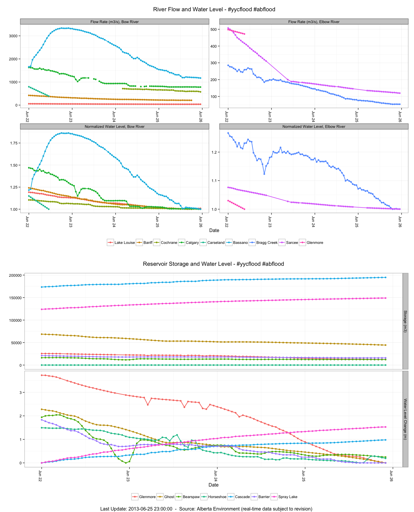

#yycflood River Data
========

#yycflood 2013 River Data Plots

This R analysis pulls river flow and height data from Alberta Environment, and generates a plot for both the Bow & Elbow rivers showing flow-rate trends and normalized water levels (relative to pre-flood levels). 

