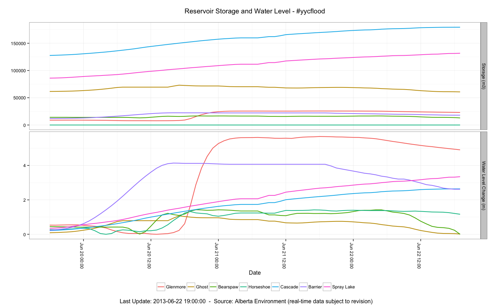

Alberta Bow River Basin: Flow, Reservoir Storage & Water Level Data (\#yycflood)
========

### Summary

This R analysis pulls river flow and height data from Alberta Environment, and generates a plot for both the Bow & Elbow rivers showing flow-rate trends and normalized water levels (relative to pre-flood levels).
It also pulls reservoir water level and storage volumes from dam controlled reservoirs / lakes. 

### Flow & Water Level Plots

**Note:** Real-time data is subject to revision.

---------------------------

### Data Sources:

Alberta Environment:
http://www.environment.alberta.ca/apps/basins/default.aspx

Environment Canada (Wateroffice):
http://www.wateroffice.ec.gc.ca/graph/graph_e.html?stn=05BH004